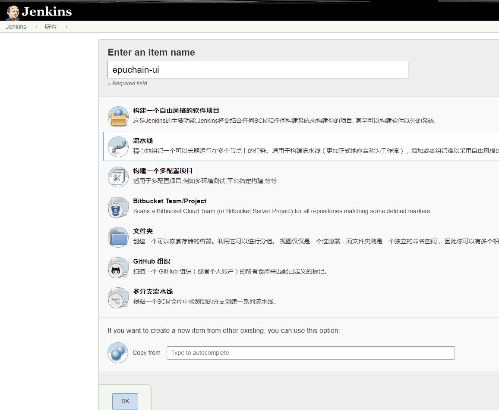
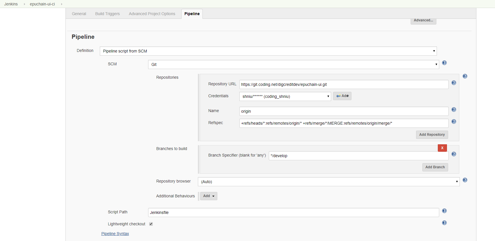
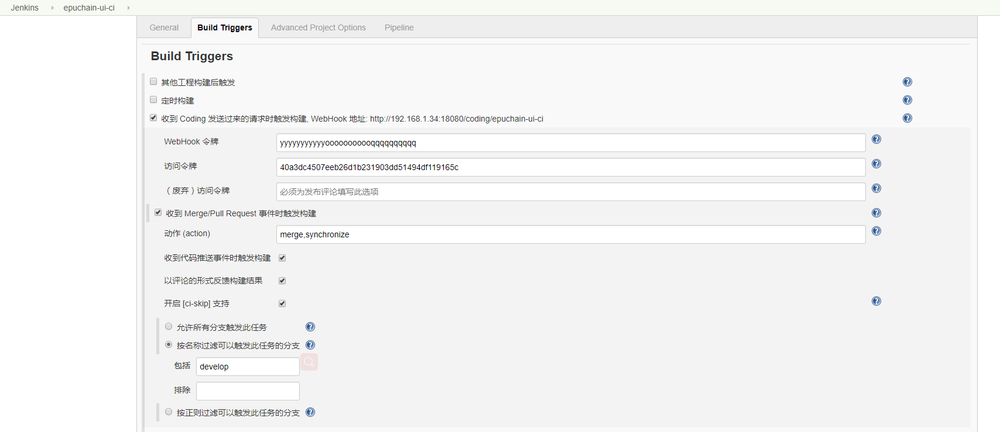
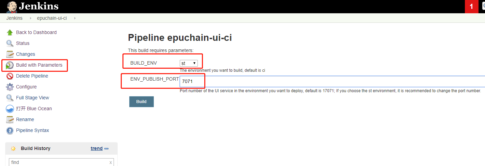

## CI for epuchain-ui

> 文档目标: 主要介绍和 epuchain-ui 项目相关的 CI 环境构建，ST 环境构建和发布生产环境使用的镜像等。
 
 
 epuchain-ui 项目是 epuchain 的前端项目，是产品使用的入口。
 
 **关于构建的说明**
 
 由于 Vue 项目 Build 发布包和现在采用的部署方式的限制，需要为每个环境单独 Build 发布包，
 比如 CI 环境需要访问的后端 API 的服务地址是 `192.168.1.34:18081`, 那么就需要 `npm run build:ci`, 如果
 需要发布到生产环境使用，且发布的后端 API 的服务地址是 `https://trade.epuchain.com`, 那么就需要 
 `npm run build`; 然后就可以得到所需要的不同环境的发布包。
 
 具体每个环境的后端 API 服务的配置请参考项目文件: `src/settings.js`, 这里配置了不同环境的后端 API 服务地址。
 
### CI 自动构建
 
对于 epuchain-ui 项目的 CI 自动构建主要使用 Jenkins Pipeline 和 Coding 代码托管平台的 Webhooks 实现的。

主要涉及到 CI 环境构建、ST 环境构建、生产环境镜像发布；主要配置请参考 `Jenkinsfile`.

#### 配置 Jenkins 支持自动构建

###### 1. 安装 Jenkins 并启动 Jenkins 服务

安装和启动见之前的文档，现在我们假设已经可以访问 Jenkins 服务。

###### 2. 在 Jenkins 上配置 epuchain-ui CI 任务

- 新建任务



输入任务名称, 如 `epuchain-ui`; 并选择流水线，点击 OK

- 配置项目 Pipeline



1. SCM: 选择 Git
2. Repository URL: 填写 Git 托管平台的项目地址，这里是 `https://git.coding.net/digcreditdev/epuchain-ui.git`
3. Credentials: 选择添加的 Coding 的账户凭证
4. Name: 填写 `origin`
5. Refspec: 填写 `+refs/heads/*:refs/remotes/origin/* +refs/merge/*/MERGE:refs/remotes/origin/merge/*`
6. Branch Specifier: 选择默认要构建的分支，我们这里选择 develop 分支(这是我们目前的主干开发分支)，填写 `*/develop`
7. Script Path: 这里填写 `Jenkinsfile` 即可，因为我们的 `Jenkinsfile` 在项目的根目录下

- 配置 Build triggers



1. 选择`收到 Coding 发送过来的请求时触发构建`
2. WebHook 令牌: `yyyyyyyyyyyooooooooooqqqqqqqqqq`
3. 访问令牌：`40a3dc4507eeb26d1b231903dd51494df119165c`
2. 其他配置见截图

- 最后点击 Save，然后主动点击`立即构建`开始构建

###### 3. 构建及部署

- CI 环境

构建流水线默认情况下是当有代码提交到 `develop` 分支或者有 `Pull Request` 合并到 `develop` 分支都会自动触发构建，这是默认行为。CI 也是默认触发构建的环境。

- ST 环境

此外构建流水线支持将某次 Commit 发布为 ST 环境的部署版本，触发部署 ST 环境并没有自动触发，只能人工去点击 Build 按钮进行部署。



1. BUILD_ENV: 选择 `st`
2. ENV_PUBLISH_PORT: 这里填写 `7071`， 自己规划好就可以
3. 点击 BUILD 即可开始构建 ST 环境

**特殊说明**：

要注意在 build 的时候，ST 环境对应的后端 API 服务的地址，我们现在希望可以通过外网访问 ST 环境(目前的配置是 `http://test.epuchain.com`)，所以最好检查一下映射关系。
需要将 `http://test.epuchain.com:7071` 映射到内网可访问的服务上来访问 ST 的 UI 服务。

- Prod 发布镜像

此构建流程也支持将某次 Commit 发布为 Prod 的部署镜像，但是并没有自动触发机制，需要人工点击 Build，方式和构建 ST 是一样的方式，区别是：

1. BUILD_ENV: 选择 `prod`
2. 点击 BUILD

镜像默认就会传到阿里云的镜像托管平台，我们在部署生产环境的时候就可以使用了。

#### 镜像 tag 策略

目前镜像的 tag 策略使用 git commit id 的前7位，比如：

```
// ci 环境构建出的镜像
registry.cn-beijing.aliyuncs.com/epuchain/epuchain-ui:bf8680c.ci

// st 环境构建出的镜像
registry.cn-beijing.aliyuncs.com/epuchain/epuchain-ui:bf8680c.st

// prod 环境构建出的镜像
registry.cn-beijing.aliyuncs.com/epuchain/epuchain-ui:bf8680c
```
